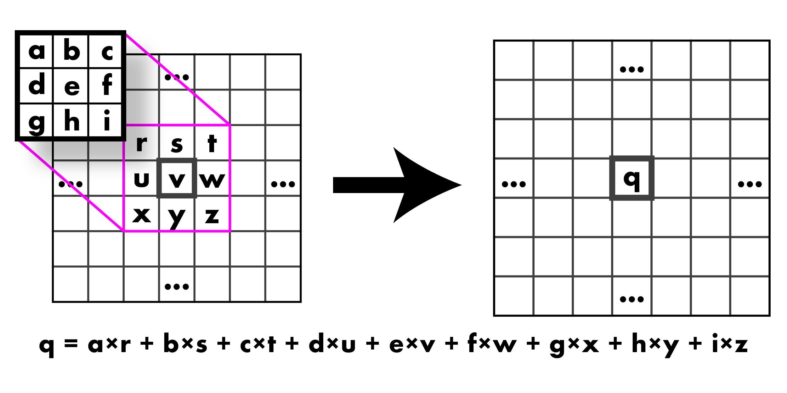
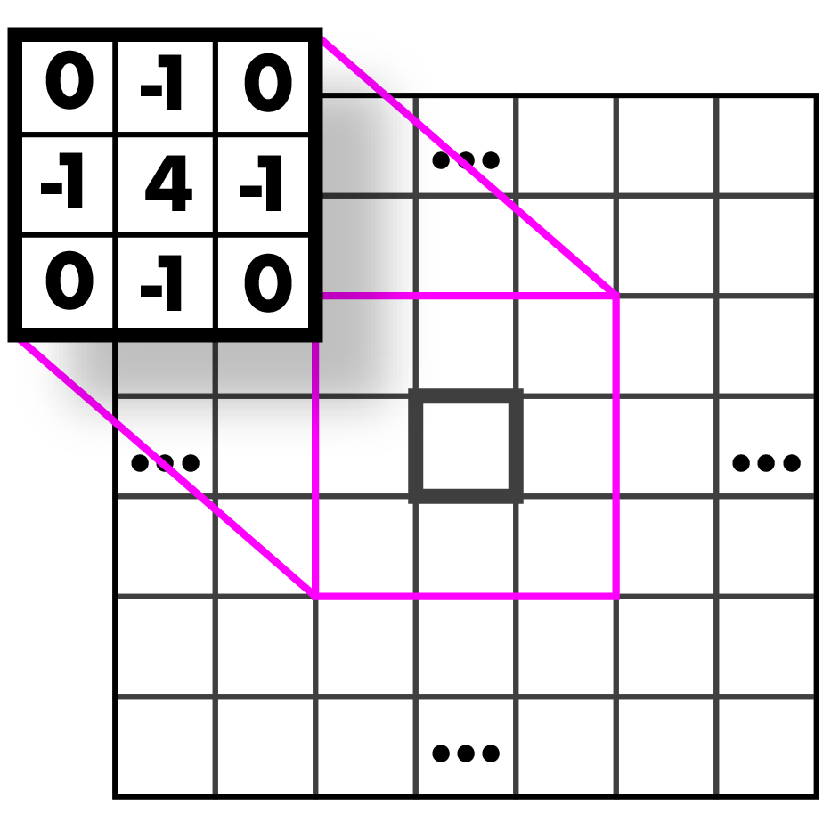
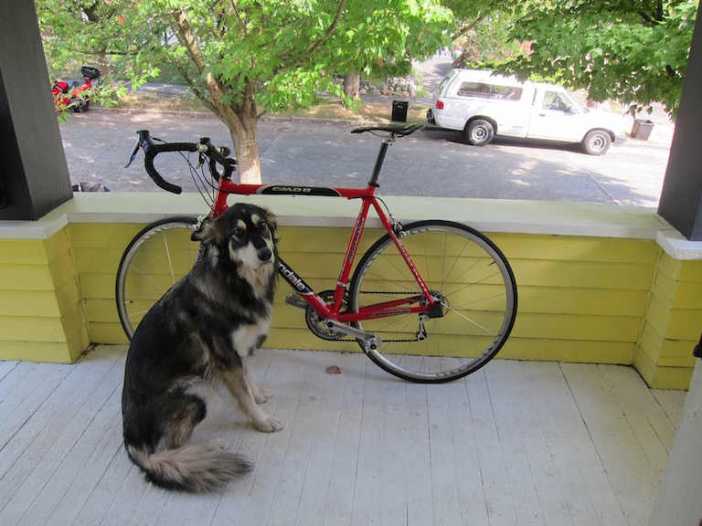
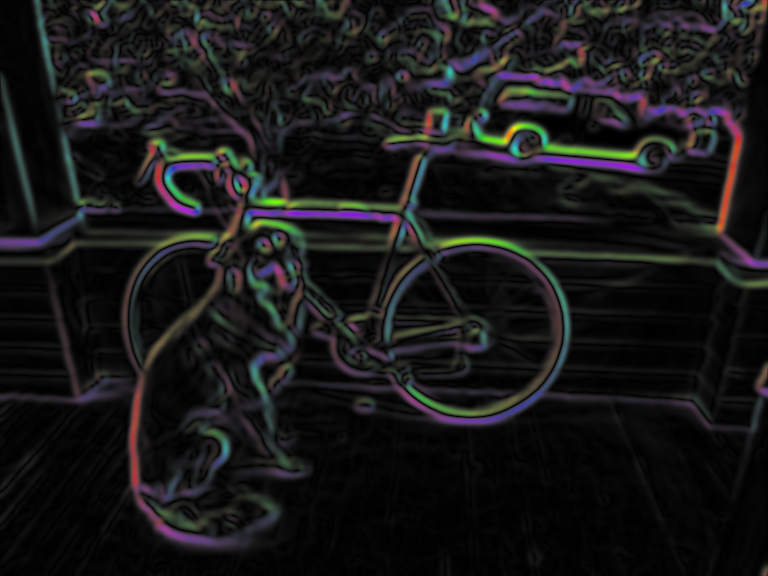

# CSE 455 Homework 1 #

Welcome friends,

It's time for assignment 1! This one may be a little harder than the last one so remember to start early and start often! In order to make grading easier, please only edit the files we mention. You should be able to submit `resize_image.c` and `filter_image.c` and we should be able to compile and run them with a fresh clone of the repo without any other files.

To start out this homework, copy over your `process_image.c` file from hw0 to the `src` file in this homework. We will be continuing to build out your image library.

## 1. Image resizing ##

We've been talking a lot about resizing and interpolation in class, now's your time to do it! To resize we'll need some interpolation methods and a function to create a new image and fill it in with our interpolation methods.

- Fill in `float nn_interpolate(image im, float x, float y, int c);` in `src/resize_image.c`
    - It should perform nearest neighbor interpolation. Remember to use the closest `int`, not just type-cast because in C that will truncate towards zero.
- Fill in `image nn_resize(image im, int w, int h);`. It should:
    - Create a new image that is `w x h` and the same number of channels as `im`
    - Loop over the pixels and map back to the old coordinates
    - Use nearest-neighbor interpolate to fill in the image

Now you should be able to run the following `python` command:

    from uwimg import *
    im = load_image("data/dogsmall.jpg")
    a = nn_resize(im, im.w*4, im.h*4)
    save_image(a, "dog4x-nn")

Your image should look something like:

Finally, fill in the similar functions `bilinear_interpolate` and `bilinear_resize` to perform bilinear interpolation. Try it out again in `python`:

    from uwimg import *
    im = load_image("data/dogsmall.jpg")
    a = bilinear_resize(im, im.w*4, im.h*4)
    save_image(a, "dog4x-bl")

These functions will work fine for small changes in size, but when we try to make our image smaller, say a thumbnail, we get very noisy results:

    from uwimg import *
    im = load_image("data/dog.jpg")
    a = nn_resize(im, im.w//7, im.h//7)
    save_image(a, "dog7th-bl")

As we discussed, we need to filter before we do this extreme resize operation!

## 2. Image filtering with convolutions ##

We'll start out by filtering the image with a box filter. There are very fast ways of performing this operation but instead, we'll do the naive thing and implement it as a convolution because it will generalize to other filters as well!
    
### 2.1 Create your box filter ###

Ok, bear with me. We want to create a box filter, which as discussed in class looks like this:

One way to do this is make an image, fill it in with all 1s, and then normalize it. That's what we'll do because the normalization function may be useful in the future!

First fill in `void l1_normalize(image im)`. This should normalize an image to sum to 1.

Next fill in `image make_box_filter(int w)`. We will only use square box filters so just make your filter `w x w`. It should be a square image with one channel with uniform entries that sum to 1.

### 2.2 Write a convolution function ###

Now it's time to fill in `image convolve_image(image im, image filter, int preserve)`. For this function we have a few scenarios. With normal convolutions we do a weighted sum over an area of the image. With multiple channels in the input image there are a few possible cases we want to handle:

- If `filter` and `im` have the same number of channels then it's just a normal convolution. We sum over spatial and channel dimensions and produce a 1 channel image. UNLESS:
- If `preserve` is set to 1 we should produce an image with the same number of channels as the input. This is useful if, for example, we want to run a box filter over an RGB image and get out an RGB image. This means each channel in the image will be filtered by the corresponding channel in the filter. UNLESS:
- If the `filter` only has one channel but `im` has multiple channels we want to apply the filter to each of those channels. Then we either sum between channels or not depending on if `preserve` is set.

Also, `filter` better have either the same number of channels as `im` or have 1 channel. I check this with an `assert`.

We are calling this a convolution but you don't need to flip the filter or anything (we're actually doing a cross-correlation). Just apply it to the image as we discussed in class:

Once you are done, test out your convolution by filtering our image! We need to use `preserve` because we want to produce an image that is still RGB.

    from uwimg import *
    im = load_image("data/dog.jpg")
    f = make_box_filter(7)
    blur = convolve_image(im, f, 1)
    save_image(blur, "dog-box7")

We'll get some output that looks like this:

Now we can use this to perform our thumbnail operation:

    from uwimg import *
    im = load_image("data/dog.jpg")
    f = make_box_filter(7)
    blur = convolve_image(im, f, 1)
    thumb = nn_resize(blur, blur.w//7, blur.h//7)
    save_image(thumb, "dogthumb")

Look at how much better our new resized thumbnail is!

Resize                     |  Blur and Resize
:-------------------------:|:-------------------------:
    | 

### 2.2 Make some more filters and try them out! ###

Fill in the functions `image make_highpass_filter()`, `image make_sharpen_filter()`, and `image make_emboss_filter()` to return the example kernels we covered in class. Try them out on some images! After you have, answer Question 2.2.1 and 2.2.2 in the source file (put your answer just right there)

Highpass                   |  Sharpen                  | Emboss
:-------------------------:|:-------------------------:|:--------------------|
     |      | 

### 2.3 Implement a Gaussian kernel ###

Implement `image make_gaussian_filter(float sigma)` which will take a standard deviation value and return a filter that smooths using a gaussian with that sigma. How big should the filter be, you ask? 99% of the probability mass for a gaussian is within +/- 3 standard deviations so make the kernel be 6 times the size of sigma. But also we want an odd number, so make it be the next highest odd integer from 6x sigma.

We need to fill in our kernel with some values. Use the probability density function for a 2d gaussian:

Technically this isn't perfect, what we would really want to do is integrate over the area covered by each cell in the filter. But that's much more complicated and this is a decent estimate. Remember though, this is a blurring filter so we want all the weights to sum to 1. If only we had a function for that....

Now you should be able to try out your new blurring function! It should have much less noise than the box filter:

    from uwimg import *
    im = load_image("data/dog.jpg")
    f = make_gaussian_filter(2)
    blur = convolve_image(im, f, 1)
    save_image(blur, "dog-gauss2")

## 3. Hybrid images ##

Gaussian filters are cool because they are a true low-pass filter for the image. This means when we run them on an image we only get the low-frequency changes in an image like color. Conversely, we can subtract this low-frequency information from the original image to get the high frequency information!

Using this frequency separation we can do some pretty neat stuff. For example, check out [this tutorial on retouching skin](https://petapixel.com/2015/07/08/primer-using-frequency-separation-in-photoshop-for-skin-retouching/) in Photoshop (but only if you want to).

We can also make [really trippy images](http://cvcl.mit.edu/hybrid/OlivaTorralb_Hybrid_Siggraph06.pdf) that look different depending on if you are close or far away from them. That's what we'll be doing. They are hybrid images that take low frequency information from one image and high frequency info from another. Here's a picture of.... what exactly?

Small                     |  Medium | Large
:-------------------------:|:-------:|:------------------:
   |  | 

If you don't believe my resizing check out `figs/marilyn-einstein.png` and view it from far away and up close. Sorta neat, right?

Your job is to produce a similar image. But instead of famous dead people we'll be using famous fictional people! In particular, we'll be exposing the secret (but totally canon) sub-plot of the Harry Potter franchise that Dumbledore is a time-traveling Ron Weasely. Don't trust me?? The images don't lie! Wake up sheeple!

Small                     | Large
:-------------------------:|:------------------:
   |  

For this task you'll have to extract the high frequency and low frequency from some images. You already know how to get low frequency, using your gaussian filter. To get high frequency you just subtract the low frequency data from the original image.

Fill in `image add_image(image a, image b)` and `image sub_image(image a, image b)` so we can perform our transformations. They should probably include some checks that the images are the same size and such. Now we should be able to run something like this:

    from uwimg import *
    im = load_image("data/dog.jpg")
    f = make_gaussian_filter(2)
    lfreq = convolve_image(im, f, 1)
    hfreq = im - lfreq
    reconstruct = lfreq + hfreq
    save_image(lfreq, "low-frequency")
    save_image(hfreq, "high-frequency")
    save_image(reconstruct, "reconstruct")

Low frequency           |  High frequency | Reconstruction
:-------------------------:|:-------:|:------------------:
   |  | 

Note, the high-frequency image overflows when we save it to disk? Is this a problem for us? Why or why not?

Use these functions to recreate your own Ronbledore image. You will need to tune your standard deviations for the gaussians you use. You will probably need different values for each image to get it to look good.

## 4. Sobel filters ##

The [Sobel filter](https://www.researchgate.net/publication/239398674_An_Isotropic_3x3_Image_Gradient_Operator) is cool because we can estimate the gradients and direction of those gradients in an image. They should be straightforward now that you all are such pros at image filtering.

### 4.1 Make the filters ###

First implement the functions to make our sobel filters. They are for estimating the gradient in the x and y direction:

Gx                 |  Gy 
:-----------------:|:------------------:
   |  

### 4.2 One more normalization... ###

To visualize our sobel operator we'll want another normalization strategy, [feature normalization](https://en.wikipedia.org/wiki/Feature_scaling). This strategy is simple, we just want to scale the image so all values lie between [0-1]. In particular we will be [rescaling](https://en.wikipedia.org/wiki/Feature_scaling#Rescaling) the image by subtracting the minimum from all values and dividing by the range of the data. If the range is zero you should just set the whole image to 0 (don't divide by 0 that's bad).

### 4.3 Calculate gradient magnitude and direction ###

Fill in the function `image *sobel_image(image im)`. It should return two images, the gradient magnitude and direction. The strategy can be found [here](https://en.wikipedia.org/wiki/Sobel_operator#Formulation). We can visualize our magnitude using our normalization function:

    from uwimg import *
    im = load_image("data/dog.jpg")
    res = sobel_image(im)
    mag = res[0]
    feature_normalize(mag)
    save_image(mag, "magnitude")

Which results in:

### 4.4 Make a colorized representation ###

Now using your sobel filter try to make a cool, stylized one. Fill in the function `image colorize_sobel(image im)`. I used the magnitude to specify the saturation and value of an image and the angle to specify the hue but you can do whatever you want (as long as it looks cool). I also used some smoothing:

## 5. Turn it in ##

Turn in your `resize_image.c`, `filter_image.c`, `ronbledore.jpg` and `sobel.jpg` on canvas under Assignment 1.

